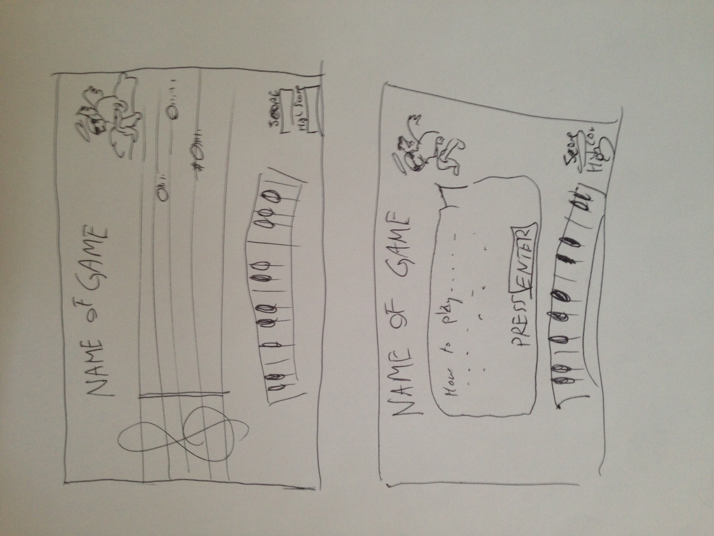

#Joyful Noize

##Overview

I created a game to test your musical sight-reading skills for keyboard
instruments. When the player loads the page, they're greeted by a cherub
character with a guitar. They can also see a piano keyboard at the bottom of
the screen. Each piano key has the not name written on it as well as the
computer key that corresponds to that piano key. The keyboard can be played,
producing the sound of an electric guitar. There is also a table in the bottom
right that displays a score and a high score.

When the game starts, notes to a song begin to scroll left from off screen,
and they must be played correctly in order before an unplayed note makes it the
measure bar on the far left. In this way, the game is something like a cross
between Missile Command and Guitar Hero, but sideways.

Players earn 5 points when they play a correct note, and lose 1 point when they
play an incorrect note.

##Technologies Used

* HTML, CSS, JavaScript
* jQuery
* Trello
* Sublime Text
* Google Fonts

##Wireframe
